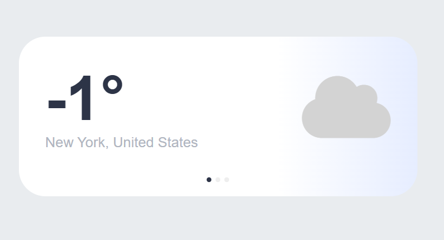

# weather-widget-challenge-2026-1.5

# 🌤️ Minimal Weather Widget

Un widget meteo elegante, minimale e interattivo ispirato al design moderno di iOS. Il widget presenta un sistema a slide fluide, gradienti dinamici basati sul ciclo giorno/notte e dati in tempo reale.

## ✨ Funzionalità

- **Dati in Tempo Reale**: Integrazione con l'API di Open-Meteo per previsioni accurate.
- **Geocoding**: Ricerca automatica delle coordinate basata sul nome della città.
- **Sistema a Slide**:
  - **Slide 1**: Meteo attuale con gradiente dinamico (Giallo per il giorno, Blu per la notte).

  ```markdown
  

  - **Slide 2**: Previsioni orarie per le prossime 5 ore.

  - **Slide 3**: Previsioni giornaliere per i prossimi 5 giorni.
  ```

## 🛠️ Tecnologie Utilizzate

- **HTML5 / CSS3**: Struttura e animazioni personalizzate.
- **JavaScript (ES6+)**: Logica del widget e manipolazione del DOM.
- **Axios**: Per le chiamate API asincrone.
- **Open-Meteo API**: Per i dati meteorologici e di geolocalizzazione.
- **Font Awesome**: Per le icone vettoriali.

## 🚀 Installazione

1.  Clona la repository o copia i file nel tuo progetto.
2.  Assicurati di includere le dipendenze nel tuo file HTML:

```html
<script src="[https://cdn.jsdelivr.net/npm/axios/dist/axios.min.js](https://cdn.jsdelivr.net/npm/axios/dist/axios.min.js)"></script>
<link
  rel="stylesheet"
  href="[https://cdnjs.cloudflare.com/ajax/libs/font-awesome/6.5.1/css/all.min.css](https://cdnjs.cloudflare.com/ajax/libs/font-awesome/6.5.1/css/all.min.css)"
/>
```

## 📍 Personalizzazione della Località

Per visualizzare il meteo della tua città, apri il file `script.js` e modifica la costante `city` all'inizio del file.

Esempio:

```javascript
// 1. Configurazione
const city = "Roma";
const countryCode = "IT";
```
